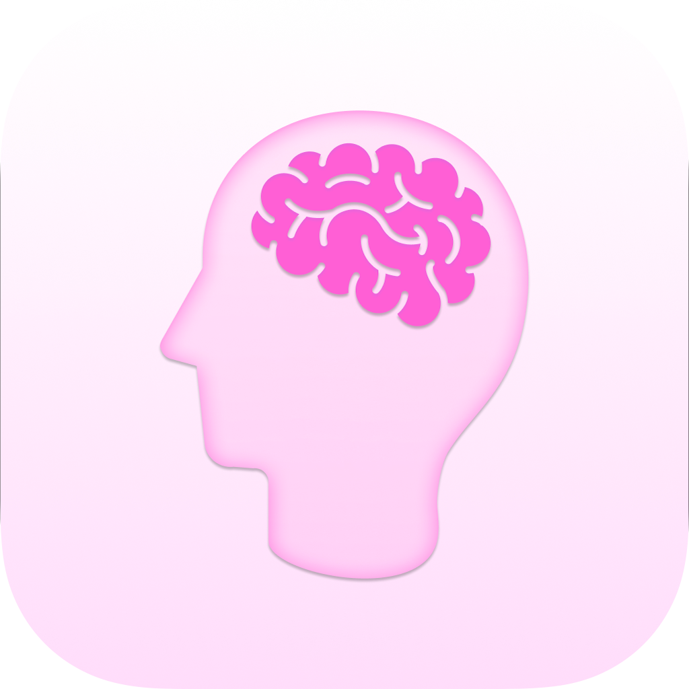

<!-- Improved compatibility of back to top link -->

<!--
*** Thanks for checking out the Best-README-Template. If you have a suggestion
*** that would make this better, please fork the repo and create a pull request
*** or simply open an issue with the tag "enhancement".
*** Don't forget to give the project a star!
*** Thanks again! Now go create something AMAZING! :D
-->

<!-- PROJECT SHIELDS -->
<!--
*** I'm using markdown "reference style" links for readability.
*** Reference links are enclosed in brackets [ ] instead of parentheses ( ).
*** See the bottom of this document for the declaration of the reference variables
*** for contributors-url, forks-url, etc. This is an optional, concise syntax you may use.
*** https://www.markdownguide.org/basic-syntax/#reference-style-links
-->
[![LinkedIn][linkedin-shield]][linkedin-url]
[![MIT License][license-shield]][license-url]

<!-- PROJECT LOGO -->
 

  

  <h3 align="center">Foco<h3>

  

    Swift Student Challenge 2024
     
     
  

<!-- ABOUT THE PROJECT -->
# About The Project

[![Product Name Screen Shot][product-screenshot]](https://github.com/JoaoFranco03/Foco)

This project is an interactive iOS app developed for the Swift Student Challenge 2024 (SSC24). Foco is designed to help students manage their time efficiently and prioritize their mental health.

Key features of the app include:

1. **Task Management**: Users can organize and track their tasks to stay motivated and on top of their responsibilities.
2. **Knowledge Reinforcement**: Through flashcards, users can reinforce their learning and retain complex information more effectively.
3. **Focus Techniques**: The app offers proven techniques for maximizing focus and incorporating effective breaks.
4. **Mental Well-being Tools**: Features to support mental health, such as breathing exercises and inspirational quotes.

(<a href="#readme-top">back to top</a>)

## Built With

* [![Swift][Swift.org]][Swift-url]
* [![Xcode][xcode-shield]][xcode-url]

(<a href="#readme-top">back to top</a>)

<!-- LICENSE -->
## License

Distributed under the GPL-3.0 License. See `LICENSE` for more information.

(<a href="#readme-top">back to top</a>)

<!-- CONTACT -->
## Contact

João Franco - [LinkedIn](https://www.linkedin.com/in/joão-franco-452161195/)

Project Link: [https://github.com/JoaoFranco03/Foco](https://github.com/JoaoFranco03/Foco)

(<a href="#readme-top">back to top</a>)

<!-- ACKNOWLEDGMENTS -->
## Acknowledgments

* [Choose an Open Source License](https://choosealicense.com)
* [SF Symbols](https://developer.apple.com/sf-symbols/)

(<a href="#readme-top">back to top</a>)

<!-- MARKDOWN LINKS & IMAGES -->
<!-- https://www.markdownguide.org/basic-syntax/#reference-style-links -->
[contributors-shield]: https://img.shields.io/github/contributors/othneildrew/Best-README-Template.svg?style=for-the-badge
[contributors-url]: https://github.com/othneildrew/Best-README-Template/graphs/contributors
[forks-shield]: https://img.shields.io/github/forks/othneildrew/Best-README-Template.svg?style=for-the-badge
[forks-url]: https://github.com/othneildrew/Best-README-Template/network/members
[stars-shield]: https://img.shields.io/github/stars/othneildrew/Best-README-Template.svg?style=for-the-badge
[stars-url]: https://github.com/othneildrew/Best-README-Template/stargazers
[issues-shield]: https://img.shields.io/github/issues/othneildrew/Best-README-Template.svg?style=for-the-badge
[issues-url]: https://github.com/othneildrew/Best-README-Template/issues
[xcode-shield]: https://img.shields.io/badge/Xcode-007ACC?style=for-the-badge&logo=Xcode&logoColor=white
[xcode-url]: https://developer.apple.com/xcode/
[license-shield]: https://img.shields.io/github/license/JoaoFranco03/Foco.svg?style=for-the-badge
[license-url]: https://github.com/JoaoFranco03/Foco/blob/main/LICENSE
[linkedin-shield]: https://img.shields.io/badge/-LinkedIn-black.svg?style=for-the-badge&logo=linkedin&colorB=555
[linkedin-url]: https://www.linkedin.com/in/joão-franco-452161195/
[product-screenshot]: assets/Mockup.png
[Swift.org]: https://img.shields.io/badge/Swift-FA7343?style=for-the-badge&logo=swift&logoColor=white
[Swift-url]: https://www.swift.org
